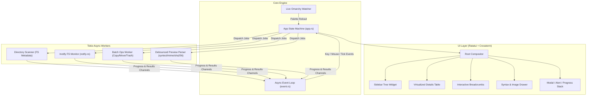

```
  ███████╗███████╗███╗   ██╗███████╗███████╗████████╗██████╗  █████╗ 
  ██╔════╝██╔════╝████╗  ██║██╔════╝██╔════╝╚══██╔══╝██╔══██╗██╔══██╗
  █████╗  █████╗  ██╔██╗ ██║█████╗  ███████╗   ██║   ██████╔╝███████║
  ██╔══╝  ██╔══╝  ██║╚██╗██║██╔══╝  ╚════██║   ██║   ██╔══██╗██╔══██║
  ██║     ███████╗██║ ╚████║███████╗███████║   ██║   ██║  ██║██║  ██║
  ╚═╝     ╚══════╝╚═╝  ╚═══╝╚══════╝╚══════╝   ╚═╝   ╚═╝  ╚═╝╚═╝  ╚═╝
```

<div align="center">

### A keyboard-driven, mouse-capable terminal file explorer with classical desktop file manager ergonomics.

[](https://github.com/Luciano-Sparti/fenestra/actions/workflows/ci.yml)
[](LICENSE)
[](https://www.rust-lang.org/)
[](https://ratatui.rs)
[](https://kernel.org)

[Features](#-features) • [Why Fenestra](#-why-fenestra) • [Installation](#-installation) • [Keybindings](#-keybindings) • [Configuration](#-configuration) • [Technical Architecture](#-technical-architecture)

</div>

---

## 🪟 Overview

**Fenestra** (Latin for *window*) bridges the gap between terminal efficiency and modern desktop ergonomics. While existing TUI file managers rely on minimalist Miller columns or dual-pane orthodox layouts, Fenestra recreates the intuitive visual language of modern desktop explorers (like KDE Dolphin and Windows File Explorer) directly inside your terminal — complete with **full mouse interaction**, **interactive breadcrumbs**, **collapsible directory trees**, and **rich multimodal file previews**.

---

## 💡 Why Fenestra?

| Capability | Fenestra | Traditional TUI Managers (*ranger*, *lf*, *nnn*, *yazi*) |
| :--- | :--- | :--- |
| **Shell Layout** | **Desktop Explorer** (Sidebar tree + Breadcrumbs + Sortable details table) | Miller columns or dual text panes |
| **Mouse Interaction** | **Full First-Class Support** (Click, double-click, drag & drop, scroll, column resize) | Keyboard-focused; partial or minimal mouse support |
| **Deletion Safety** | **Freedesktop Trash** by default (`trash-rs`), hard delete on `Shift+Delete` | Permanent deletion by default |
| **Theming** | **Live Hot-Reload** (Watches Omarchy system palette via inotify) | Static config themes requiring manual restart |
| **Inspection** | **Multimodal Preview Drawer** (Syntax highlighting, Kitty/Sixel/iTerm2 image graphics, archive listings, hex dump) | Plugin-dependent or external CLI scripts |

---

## ✨ Features

### 🗂️ Desktop-Class Shell Layout
- **Collapsible Sidebar Tree**: Hierarchical directory tree with lazy-loaded expansion and folder quick-filters.
- **Sortable Details View**: Natural sorting by Name, Size, Date Modified, or Permissions with dynamic column auto-fit and resizability.
- **Interactive Breadcrumb Bar**: Clickable path chips with dropdown menus for sibling directories, plus `Ctrl+L` editable path mode with autocompletion.
- **Multi-Tab & Dual-Pane**: Browse multiple directories concurrently using tabs (`Ctrl+T`) or split into dual-pane Commander view (`F3`).

### 🖱️ Seamless Hybrid Navigation
- **True Mouse Ergonomics**: Click to focus, double-click to open, drag-and-drop between panes/folders, mouse-wheel smooth scrolling, and right-click context menus.
- **Vim & Standard Keyboard Controls**: Navigate seamlessly with `hjkl` or standard arrow keys, `Enter`, `Backspace`, and `Tab`.
- **Advanced Desktop Multi-Selection**: Select items with `Space`, range-select with `Shift+Arrows`, toggle individual items with `Ctrl+Click`, or select all with `Ctrl+A`.

### 🛡️ Safe & Resilient File Operations
- **Non-Blocking Background Operations**: Copy, move, cut, paste, and batch delete off the main UI thread with interactive progress bars.
- **Freedesktop System Trash**: Accidental deletions are prevented by moving files to XDG Trash by default; permanent deletion is reserved for `Shift+Delete`.
- **Conflict Resolution Dialogs**: Interactive conflict resolution prompts (Overwrite, Skip, Auto-Rename) when collisions are detected.

### 👁️ Multimodal Rich Previews
- **Syntax-Highlighted Code**: Automatic language detection and debounced asynchronous rendering via `syntect`.
- **High-Resolution Terminal Images**: Built-in image rendering supporting **Kitty**, **Sixel**, **iTerm2**, and unicode halfblock fallback via `ratatui-image`.
- **Archive Inspection**: Peek inside `.zip`, `.tar.gz`, `.tar.xz`, and `.7z` archives without extracting them to disk.
- **Binary Hex Dump**: Built-in `xxd`-style hex dump viewer with ASCII side-panels for binaries and unknown payloads.
- **Metadata Inspector**: Off-thread calculation of file MIME types, permissions, symlink targets, and SHA-256 checksums.

### 🎨 Live Theming & Polish
- **Omarchy Dynamic Theme Sync**: Automatically watches `~/.config/omarchy/current/theme` to hot-reload color palettes instantly without restarts.
- **Curated Built-in Themes**: Catppuccin Mocha, Catppuccin Latte, Tokyo Night, Gruvbox, Nord, Solarized, and ANSI fallback palettes.
- **Nerd Fonts & LS_COLORS**: File icons styled via Nerd Fonts v3 (with Unicode and ASCII fallbacks) and native `$LS_COLORS` syntax highlighting.
- **Keyboard Chord Discovery**: Pressing an incomplete `Ctrl` or `Alt` chord displays an instant discovery panel showing all available key combos.

---

## 🚀 Installation

### 1. Quick Install (Linux x86_64 / aarch64)

Install the latest prebuilt release binary, man pages, shell completions, and desktop entry with a single command:

```bash
curl -sSL https://raw.githubusercontent.com/Luciano-Sparti/fenestra/main/install.sh | bash
```

### 2. Arch Linux (AUR)

```bash
# Build from source
yay -S fenestra

# Or install prebuilt binary
yay -S fenestra-bin
```

### 3. Cargo (crates.io)

```bash
cargo install fenestra
```

### 4. Building from Source

```bash
# Clone the repository
git clone https://github.com/Luciano-Sparti/fenestra.git
cd fenestra

# Build and package locally
./scripts/package.sh

# Or install directly
cargo install --path .
```

---

## 🎮 Usage & Quick Start

```bash
# Launch in the current directory
fenestra

# Launch into a specific path
fenestra ~/Documents/Projects

# View CLI options
fenestra --help
```

---

## ⌨️ Essential Keybindings

| Keybinding | Action |
| :--- | :--- |
| **Navigation & Views** | |
| `↑` / `k`, `↓` / `j` | Navigate selection up / down |
| `←` / `h` / `Backspace` | Navigate to parent directory |
| `→` / `l` / `Enter` | Open folder or launch file with default handler (`xdg-open`) |
| `Alt+←` / `Alt+→` | Navigate history backward / forward |
| `Alt+↑` | Navigate to parent directory |
| `Tab` / `Shift+Tab` | Cycle focus across panels (Sidebar ⇄ Table ⇄ Preview) |
| `Ctrl+L` | Edit path bar manually (`Tab` for auto-completion) |
| `Ctrl+T` / `Ctrl+W` | Open new tab / Close active tab |
| `Ctrl+Tab` / `Alt+1..9` | Cycle tabs / Jump directly to tab N |
| `F3` | Toggle Dual-Pane Commander mode (`Tab` swaps pane focus) |
| `F5` / `F6` | Cross-pane copy / move (in dual-pane mode) |
| `F7` / `Shift+F7` | Toggle file preview panel / Cycle dock position (Side ⇄ Bottom) |
| `v` | Quick look (open and focus preview) |
| `b` / `F9` | Toggle sidebar tree visibility |
| `Ctrl+H` / `.` | Toggle hidden / dotfiles |
| `s` / `r` (or `Shift+S`) | Cycle sort column / Reverse sort direction |
| **Selection & Operations** | |
| `Space` / `Ctrl+Click` | Toggle multi-selection on active item |
| `Shift+↑` / `Shift+↓` | Range multi-selection |
| `Ctrl+A` / `*` | Select all items / Invert selection |
| `Ctrl+C` / `Ctrl+X` / `Ctrl+V` | Copy / Cut / Paste selection (non-blocking async) |
| `F2` | Rename selected item |
| `Ctrl+N` | Create new folder |
| `Ctrl+Shift+N` | Create new empty file |
| `Delete` | Move selection to System Trash (immediate) |
| `d` | Move selection to Trash with confirmation dialog |
| `Shift+Delete` | Permanently delete selection (confirmed) |
| `m` / `Menu` / `Shift+F10` | Open context menu (also via Right Click) |
| `Ctrl+J` | Open background job queue (view progress / cancel jobs) |
| **Search & System** | |
| `/` | Live in-place quick filter |
| `Ctrl+F` | Non-blocking recursive search across subdirectories |
| `e` | Open selection in `$EDITOR` / `$VISUAL` |
| `p` | View selection read-only in `$PAGER` |
| `` ` `` / `F4` | Launch terminal shell in current directory |
| `?` / `F1` | Open interactive keybinding cheatsheet |
| `q` / `Ctrl+Q` | Quit Fenestra |

---

## ⚙️ Configuration

Fenestra is configured via a clean TOML file located at `~/.config/fenestra/config.toml`. The configuration is auto-generated on first launch if not present:

```toml
version = 1

[general]
theme = "catppuccin-mocha"   # "catppuccin-mocha" | "tokyo-night" | "gruvbox" | "nord" | "solarized-dark" | "omarchy"
show_hidden = false          # Show hidden and dotfiles by default
dirs_first = true            # Group directories before files when sorting
natural_sort = true          # Natural alphanumeric sorting (e.g. file2 before file10)
mouse_enabled = true         # Full mouse clicking, scrolling, dragging & dropping
icon_style = "nerd"          # Icon tier: "nerd" (Nerd Fonts v3), "unicode", or "ascii"
ls_colors_enabled = true     # Apply colors from $LS_COLORS environment variable
default_sort_column = "name" # "name" | "size" | "modified" | "extension" | "permissions"
default_sort_direction = "ascending" # "ascending" | "descending"

[layout]
show_sidebar = true          # Show places and directory tree sidebar
sidebar_width_percent = 20   # Percentage width allocated to sidebar
show_preview = false         # Start with preview panel open
preview_width_percent = 35   # Percentage width when preview is docked on side
preview_dock = "side"        # "side" (right column) | "bottom" (docked below table)
preview_height_percent = 30  # Percentage height when preview is docked at bottom

# Custom user actions (surfaced in context menu and cheat sheet)
# Arguments support {file}, {path}, {selected}, and {dir} placeholders
[[actions]]
name = "Git Status"
key = "g"
command = "git"
args = ["status"]

[[actions]]
name = "Extract Archive"
key = "x"
command = "tar"
args = ["xf", "{file}"]

# Optional key remappings (from -> to)
# [[remap]]
# from = "ctrl+j"
# to = "down"
```

---

## 🛠️ Technical Details

### Architecture & Internals

Fenestra is engineered from the ground up for maximum throughput, low memory footprint, and guaranteed frame responsiveness:



### Key Technical Highlights

- **Virtualized Rendering**: The details table renders only visible rows in the current terminal viewport, allowing directories containing over **100,000+ files** to scroll at a stable 60 FPS without frame lag.
- **Zero-Copy String Storage**: Powered by [`compact_str`](https://crates.io/crates/compact_str) to inline small filenames (<=24 bytes) directly on the stack without heap allocation overhead.
- **Asynchronous Non-Blocking I/O**: Filesystem scans, checksum hashing, MIME guessing, and file batch jobs run completely isolated inside dedicated [`tokio`](https://tokio.rs) threads. The UI thread is never blocked by slow disks or network mounts.
- **Symlink Cycle Guard**: Recursive directory traversal uses a custom depth-first search (DFS) with inode cycle tracking to prevent infinite loops on circular symlinks.
- **Safe Native Operations**: Leverages [`trash-rs`](https://crates.io/crates/trash) for compliant Freedesktop XDG trash specifications and POSIX safe argument execution vectors for external tooling.

### Tech Stack

| Component | Library / Tool | Purpose |
| :--- | :--- | :--- |
| **Language** | [Rust 1.78+](https://www.rust-lang.org/) | Safety, zero-cost abstractions, memory performance |
| **TUI Rendering** | [`ratatui 0.29`](https://ratatui.rs/) & [`crossterm 0.28`](https://github.com/crossterm-rs/crossterm) | Terminal graphics, event streaming, mouse tracking |
| **Async Engine** | [`tokio 1.43`](https://tokio.rs/) & [`futures 0.3`](https://docs.rs/futures) | Multi-threaded async background job orchestration |
| **FS Monitoring** | [`notify 8.0`](https://github.com/notify-rs/notify) | Real-time inotify file tree change detection |
| **Syntax Highlighting** | [`syntect 5.0`](https://github.com/trishume/syntect) | Sublime text syntax definitions with fast caching |
| **Image Protocols** | [`ratatui-image 8.0`](https://github.com/ratatui/ratatui-image) | Kitty, Sixel, iTerm2, and halfblock terminal graphics |
| **Archive Decoders** | `zip`, `tar`, `flate2`, `xz2`, `sevenz-rust` | In-memory archive header inspection without extraction |
| **Metadata & Safety** | `mime_guess`, `sha2`, `trash`, `natord`, `lscolors` | Natural sorting, hashing, MIME inspection, trash ops |

### Project Directory Structure

```text
fenestra/
├── src/
│   ├── lib.rs             # Crate root
│   ├── main.rs            # Entrypoint, terminal initialization, panic hook
│   ├── app.rs             # Application state machine, tabs, selection, context menus
│   ├── event.rs           # Crossterm input, timer ticks, async channel events
│   ├── config.rs          # TOML configuration parser and schema migration
│   ├── ui/
│   │   ├── mod.rs         # Root layout compositor and focus router
│   │   ├── tree.rs        # Sidebar directory tree widget
│   │   ├── table.rs       # Details list & column headers widget
│   │   ├── breadcrumb.rs  # Interactive breadcrumb chips and editable path bar
│   │   ├── preview.rs     # Syntax preview, image renderer, hex dump & metadata
│   │   └── dialogs.rs     # Modals: confirmations, prompts, errors, progress, context menus
│   ├── fs/
│   │   ├── mod.rs         # Filesystem data models and file entry metadata
│   │   ├── scanner.rs     # Async non-blocking directory scanner
│   │   ├── watcher.rs     # Inotify-based directory watcher
│   │   ├── ops.rs         # Safe file operations (copy, move, trash, delete, rename)
│   │   └── worker.rs      # Async background operations queue & progress events
│   └── theme/
│       ├── mod.rs         # Color palettes and Ratatui Style converters
│       └── watcher.rs     # Inotify watcher for Omarchy theme sync
├── tests/                 # Integration tests (fs ops, config, theme, headless UI)
├── benches/               # Performance benchmarks (virtual table, scanner)
├── Cargo.toml
└── LICENSE
```

---

## 🗺️ Roadmap

- [x] **Core Shell & Navigation**: Tree sidebar, virtualized details table, breadcrumbs, hybrid Vim/mouse input.
- [x] **Safe Operations & Multi-View**: Async file ops, Freedesktop Trash integration, tabs & dual-pane mode.
- [x] **Rich Previews & Polish**: Syntect syntax highlighting, Kitty/Sixel image graphics, archive inspection, live Omarchy theme sync.
- [ ] **Extended Integrations**: Custom keybinding overrides via TOML, `$PAGER` support, and Kitty keyboard protocol enhancements.
- [ ] **Packaging & Distribution**: Prebuilt binaries, AUR package (`fenestra-bin`), Debian package (`.deb`), and crates.io release.

---

## 🤝 Contributing

Contributions, issues, and feature ideas are warmly welcome!
1. Fork the repository
2. Create your feature branch (`git checkout -b feature/cool-enhancement`)
3. Commit your changes (`git commit -m 'Add some cool feature'`)
4. Push to the branch (`git push origin feature/cool-enhancement`)
5. Open a Pull Request

---

## 📜 License

This project is licensed under the [MIT License](LICENSE).
